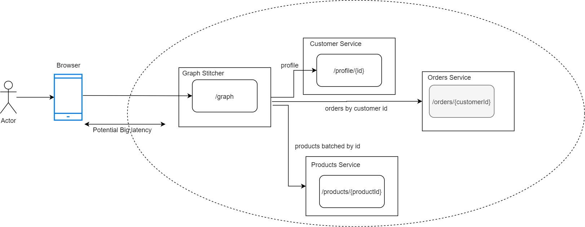

# Graph Stitching

HotChocolate example on how to setup a Graph Stiching service, with 3 other dependencies.

[Blog explanation](http://example.com)

### Running this example

1. runCustomerService
2. runOrderService.cmd
3. runProductService.cmd
4. Run or Debug the RYoshiga.GraphStitcher
5. Navigate to the http://localhost:5004/playground